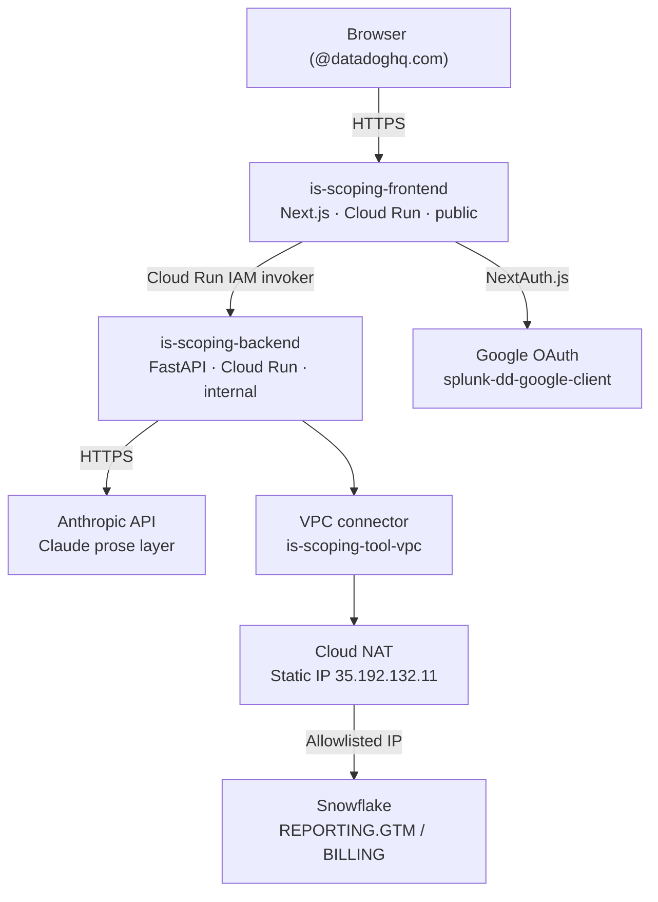
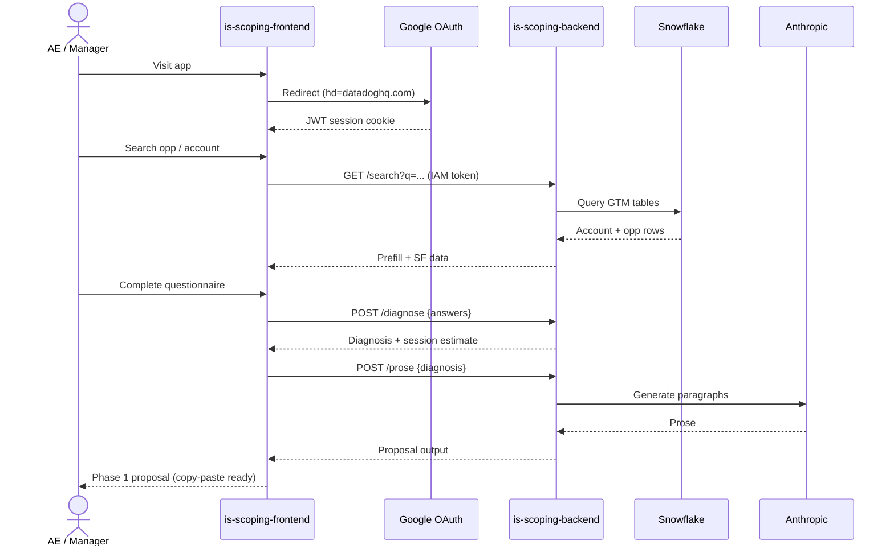
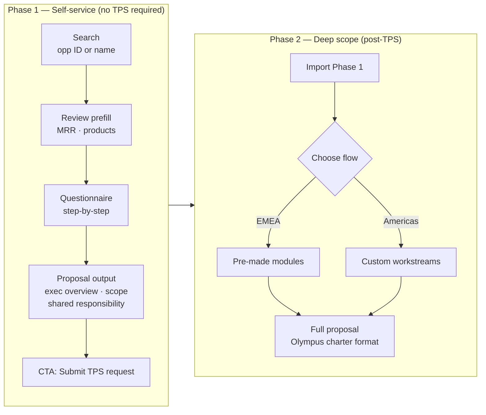

# Next.js Migration Design

**Date:** 2026-05-29
**Status:** Approved
**Authors:** Anil Pappu, James Fischer

## Context

The IS Scoping Tool is an AE-facing Streamlit app on Cloud Run that pulls Salesforce data from Snowflake, runs a questionnaire, and generates a structured IS engagement diagnosis. James Fischer (IS Regional Manager, Americas) identified two blockers to adoption:

1. The output is a diagnosis card, not a usable proposal document — it does not save AEs time
2. Streamlit's UI does not meet the standard AEs expect from modern internal tools

This spec covers migrating to Next.js + FastAPI while preserving all existing Python business logic unchanged.

## Decision

**Option A: Monorepo, two Cloud Run services.**

Single GitHub repo (`anildatadog/is-scoping-tool`) with `frontend/` (Next.js, owned by James) and `backend/` (FastAPI, owned by Anil). Two separate Cloud Run services: `is-scoping-frontend` (public) and `is-scoping-backend` (internal). All existing Python logic moves to `backend/` unchanged.

Alternatives considered:
- Single container with nginx proxy — simpler ops but two runtimes in one container, harder to scale independently
- Separate repos — cleaner ownership but API contract harder to keep in sync

## Architecture

### Repo layout

```
is-scoping-tool/
├── frontend/                    # James owns
│   ├── app/
│   │   ├── page.tsx             # Search screen
│   │   ├── questionnaire/       # Q&A flow
│   │   ├── result/              # Diagnosis + Phase 1 proposal
│   │   ├── phase2/              # Deep scope (Phase 2)
│   │   └── api/                 # Thin Next.js proxy routes → FastAPI
│   ├── components/              # Tailwind UI components
│   ├── Dockerfile
│   └── next.config.ts
├── backend/                     # Anil owns
│   ├── main.py                  # FastAPI app — thin routes only
│   ├── snowflake_lookup.py      # Unchanged
│   ├── diagnosis.py             # Unchanged
│   ├── methodologies.py         # Unchanged
│   ├── prose.py                 # Unchanged
│   ├── scoping_doc.py           # Unchanged
│   ├── Dockerfile
│   └── requirements.txt
├── shared/
│   └── api-types.ts             # Request/response shapes — single source of truth
└── docker-compose.yml           # Local dev: both services with hot-reload
```

### Cloud Run services

| Service | Runtime | Visibility | Auth | VPC connector |
|---|---|---|---|---|
| `is-scoping-frontend` | Node 20 | Public | NextAuth.js + Google OAuth | None needed |
| `is-scoping-backend` | Python 3.11 | Internal | Cloud Run IAM invoker | `is-scoping-tool-vpc` |

### System architecture



### Request flow



### Infrastructure continuity

The VPC connector (`is-scoping-tool-vpc`), Cloud NAT, and static egress IP (`35.192.132.11`) are project-level resources in `datadog-tam-sandbox` — not bound to the current service. When `is-scoping-backend` is deployed with `--vpc-connector is-scoping-tool-vpc`, it inherits the same egress IP. The Snowflake network policy (`IS_SCOPING_TOOL_NETWORK_POLICY`) requires no changes.

## Authentication

NextAuth.js replaces Streamlit's `st.login()`.

- Same Google OAuth client (`splunk-dd-google-client-*` in Secret Manager)
- `hd=datadoghq.com` restricts sign-in to Datadog accounts
- Server-side email domain check in Next.js middleware as defense-in-depth
- Session stored as signed JWT cookie (`NEXTAUTH_SECRET` in Secret Manager)
- One new redirect URI: `https://is-scoping-frontend-[hash].us-central1.run.app/api/auth/callback/google`

Frontend → backend calls use Cloud Run IAM (invoker role). User email passed in `X-User-Email` header for audit only.

## FastAPI endpoints

`main.py` is a thin wrapper — all logic stays in existing modules:

| Method | Path | Handler |
|---|---|---|
| GET | `/search?q={query}` | `snowflake_lookup.search_accounts()` |
| GET | `/lookup?opp_id={id}` | `snowflake_lookup.lookup_opp_by_id()` |
| POST | `/diagnose` | `diagnosis.diagnose()` + `methodologies.recommend()` |
| POST | `/prose` | `prose.generate()` |

## Two-phase screen flow



### Phase 1 — Self-service (AE-facing)

1. **Search** — opp ID or account name → Snowflake lookup
2. **Review prefill** — MRR, contracted products, pre-answered questions
3. **Questionnaire** — remaining questions, step-by-step
4. **Proposal output** — executive overview, customer objectives, engagement summary table, scope summary, shared responsibility model. Copy-paste ready. CTA: "Submit TPS request".

Phase 1 output must be directly handable to a customer or AE without additional work.

### Phase 2 — Deep scope (Architect / Manager, post-TPS)

5. **Import Phase 1** — auto-loaded from session
6. **Choose flow** — Pre-made modules (EMEA) or Custom (Americas)
7. **Workstream builder** — sessions per workstream, timeline, deliverables table
8. **Full proposal output** — complete project charter in Olympus charter format

## Local development

```bash
docker-compose up   # frontend on localhost:3000, backend on localhost:8000
```

James runs `cd frontend && npm run dev` — docker-compose brings the backend up with hot-reload. Secrets via `op run` into `.env.local` (frontend) and `.env` (backend).

## Deployment commands

```bash
# 1. Backend
gcloud run deploy is-scoping-backend \
  --source backend/ --project=datadog-tam-sandbox --region=us-central1 \
  --no-allow-unauthenticated \
  --vpc-connector=is-scoping-tool-vpc --vpc-egress=all-traffic \
  --set-secrets="SNOWFLAKE_PAT=is-scoping-pat:latest,SNOWFLAKE_USER=is-scoping-user:latest,ANTHROPIC_API_KEY=is-scoping-anthropic-key:latest" \
  --set-env-vars="SNOWFLAKE_ACCOUNT=sza96462.us-east-1,SNOWFLAKE_DATABASE=REPORTING,SNOWFLAKE_WAREHOUSE=AD_HOC_DEVELOPMENT_XSMALL_WAREHOUSE"

# 2. Frontend
gcloud run deploy is-scoping-frontend \
  --source frontend/ --project=datadog-tam-sandbox --region=us-central1 \
  --allow-unauthenticated \
  --set-env-vars="BACKEND_URL=https://is-scoping-backend-[hash].us-central1.run.app" \
  --set-secrets="GOOGLE_CLIENT_ID=splunk-dd-google-client-id:latest,GOOGLE_CLIENT_SECRET=splunk-dd-google-client-secret:latest,COOKIE_SECRET=is-scoping-cookie-secret:latest,NEXTAUTH_SECRET=is-scoping-nextauth-secret:latest"
```

## Migration sequence (zero downtime)

1. Deploy `is-scoping-backend` — verify Snowflake connectivity
2. Deploy `is-scoping-frontend` — verify end-to-end
3. Add new redirect URI to Google OAuth client
4. Delete old `is-scoping-tool` service
5. VPC connector, Cloud NAT, static IP, all secrets remain unchanged

## What is removed

- `is-scoping-tool` Cloud Run service (Streamlit container)
- `Scope_an_opportunity.py` (replaced by Next.js)
- `docker-entrypoint.sh` (Streamlit-specific)
- Streamlit dependencies from `requirements.txt`

## What is unchanged

- All Python modules in `backend/`
- GCP infrastructure: VPC connector, Cloud NAT, static IP, Secret Manager
- Snowflake service user and network policy
- Google OAuth client and `@datadoghq.com` restriction

## Open items

- `NEXTAUTH_SECRET` — new Secret Manager entry, generate at implementation time
- New redirect URI — add to Google OAuth client at deployment time
- Phase 2 workstream builder UI — James to propose design
- Migration question split (dashboards vs alert rules) — backend-only change, can land before migration
